# Architecture

## Component Diagram

```mermaid
graph TD
  %% ─── DATA LAYER ───────────────────────────────────────────────
  subgraph DATA["Data Layer"]
    CONFIG["game.config.ts\ngameId · title · theme · basePath"]
    INK["story/*.ink.json\ncompiled Ink script"]
    CHARS["data/characters/*.md\nsprite · animation · voice"]
    SCENES["data/scenes/*.md\nbackground · variants · ambient"]
    AUDIO_DATA["data/audio/**/*.md\nbgm · sfx · ambience · voice"]
    MINIGAME_DATA["data/minigames/*.md\ntype · config"]
    ASSETS["assets/\nimages · audio files"]
  end

  %% ─── ENGINE LAYER (FSM) ───────────────────────────────────────
  subgraph ENGINE["Engine Layer (FSM)"]
    GE["GameEngine\nIDLE → LOADING → DIALOG\n→ CHOICES → TRANSITION\n→ MINIGAME → PAUSED → ENDED"]
    SR["ScriptRunner\ninkjs · tag extraction\nStepResult · StepChoice"]
    TP["TagParser\n#tag:id,k:v parser"]
    EB["EventBus\npub/sub · on() · emit()"]
    VS["VariableStore\nink variable read/write"]
    SM["SaveManager\nlocalStorage · slots · migrations"]
    AL["AssetLoader\nimage preload cache"]
    MR["MinigameRegistry\nid → MinigameBase"]
    BGM["BgmController"]
    SFX["SfxController"]
    AMB["AmbienceController"]
    VOI["VoiceController"]
  end

  %% ─── UI LAYER (React) ─────────────────────────────────────────
  subgraph UI["UI Layer (React)"]
    APP["VnApp\nlifecycle router\nstart · game · end"]
    START["VnStartMenu\nnew game · continue"]
    STAGE["VnStage\nevent hub · AudioManager\nkeyboard input"]
    ADV["VnStageAdvance\nignore · reveal · advance"]
    BG["VnBackground\nstatic · parallax · video"]
    CHAR["VnCharacter\nsprites · spritesheet · layered"]
    DLG["VnDialog\ntypewriter reveal"]
    DR["DialogReveal\nchar-by-char state machine"]
    CHO["VnChoices\nkeyboard + mouse nav"]
    TRANS["VnTransition\nfade · slide · wipe · cut"]
    SAVEMENU["VnSaveMenu"]
    SAVEBAR["SaveControlsBar"]
    QUICKSAVE["VnQuickSave"]
    END["VnEndScreen"]
  end

  %% ─── DATA → ENGINE ────────────────────────────────────────────
  CONFIG -->|"boot()"| GE
  INK -->|"fetch + load"| SR
  CHARS -->|"fetch + parse"| GE
  SCENES -->|"fetch + parse"| GE
  AUDIO_DATA -->|"fetch + parse"| GE
  MINIGAME_DATA -->|"fetch + parse"| MR
  ASSETS -->|"preload"| AL

  %% ─── ENGINE INTERNALS ─────────────────────────────────────────
  GE --> SR
  GE --> EB
  GE --> VS
  GE --> SM
  GE --> AL
  GE --> MR
  GE --> BGM
  GE --> SFX
  GE --> AMB
  GE --> VOI
  SR --> TP
  SR -->|"StepResult"| GE

  %% ─── ENGINE → UI (events) ─────────────────────────────────────
  EB -->|"engine:scene"| BG
  EB -->|"engine:character"| CHAR
  EB -->|"engine:dialog"| DLG
  EB -->|"engine:choices"| CHO
  EB -->|"engine:transition"| TRANS
  EB -->|"engine:bgm / sfx / ambience"| STAGE
  EB -->|"end_screen"| APP

  %% ─── UI TREE ──────────────────────────────────────────────────
  APP --> START
  APP --> STAGE
  APP --> END
  STAGE --> BG
  STAGE --> CHAR
  STAGE --> DLG
  STAGE --> CHO
  STAGE --> TRANS
  STAGE --> SAVEMENU
  STAGE --> SAVEBAR
  STAGE --> QUICKSAVE
  STAGE --> ADV
  DLG --> DR

  %% ─── UI → ENGINE (commands) ───────────────────────────────────
  STAGE -->|"advance() · choose(i)"| GE
  SAVEMENU -->|"save(slot) · load(slot)"| SM
  QUICKSAVE -->|"autoSave()"| SM
```

---

## Layer Responsibilities

### Data Layer

Static files consumed at boot or on demand. No logic.

| File | Purpose |
|------|---------|
| `game.config.ts` | Game identity, theme CSS variables, base asset path |
| `story/*.ink.json` | Compiled Ink narrative script (text, branches, tags) |
| `data/characters/*.md` | Sprite type, animation atlas, expression map, voice config |
| `data/scenes/*.md` | Background type, image variants, ambient audio |
| `data/audio/**/*.md` | File path and volume per audio cue |
| `data/minigames/*.md` | Minigame type and configuration |
| `assets/` | Raw images and audio files |

### Engine Layer (FSM)

Drives the game loop. Emits events; never renders.

| Class | Role |
|-------|------|
| `GameEngine` | Central FSM and coordinator; owns all sub-systems |
| `ScriptRunner` | Wraps inkjs; advances story and extracts `TagCommand` objects |
| `TagParser` | Parses `#tag:id,key:value` syntax from Ink tags |
| `EventBus` | Pub/sub bus decoupling engine from UI |
| `VariableStore` | Read/write Ink story variables |
| `SaveManager` | Serialize/deserialize game state to `localStorage` |
| `AssetLoader` | Preloads and caches image assets |
| `MinigameRegistry` | Maps minigame IDs to `MinigameBase` implementations |
| `BgmController` | Background music playback events |
| `SfxController` | Sound effect playback events |
| `AmbienceController` | Looping ambient audio events |
| `VoiceController` | Character voice line events |

**FSM States:** `IDLE → LOADING → DIALOG → CHOICES → TRANSITION → MINIGAME → PAUSED → ENDED`

### UI Layer (React)

Reacts to engine events. Calls engine commands on player input. Never holds narrative logic.

| Component | Role |
|-----------|------|
| `VnApp` | Lifecycle router: start menu → gameplay → end screen |
| `VnStartMenu` | New game / continue selection |
| `VnStage` | Main render container; subscribes to all events; owns `AudioManager` |
| `VnStageAdvance` | Pure function: maps input + state → `ignore / reveal / advance` |
| `VnBackground` | Renders scene backgrounds (static, parallax, video) |
| `VnCharacter` | Renders character sprites and spritesheet animations |
| `VnDialog` | Dialog box with typewriter effect |
| `DialogReveal` | Character-by-character reveal state machine |
| `VnChoices` | Choice button list with keyboard and mouse navigation |
| `VnTransition` | Full-screen transition overlay (fade, slide, wipe, cut) |
| `VnSaveMenu` | Manual save/load slot UI |
| `SaveControlsBar` | Inline save controls shown during gameplay |
| `VnQuickSave` | Auto-save trigger on dialog advance |
| `VnEndScreen` | Credits and return-to-menu screen |

---

## Engine Events Reference

| Event | Payload | Consumer |
|-------|---------|----------|
| `engine:scene` | `{ id, data }` | `VnBackground` |
| `engine:character` | `{ id, position, expression, exit? }` | `VnCharacter` |
| `engine:dialog` | `{ text, speaker, nameColor, canContinue, advanceMode }` | `VnDialog` |
| `engine:choices` | `{ choices[] }` | `VnChoices` |
| `engine:transition` | `{ type, duration, direction? }` | `VnTransition` |
| `engine:bgm` | `{ id, data }` | `VnStage → AudioManager` |
| `engine:sfx` | `{ id, data }` | `VnStage → AudioManager` |
| `engine:ambience` | `{ id, data }` | `VnStage → AudioManager` |
| `engine:minigame:start` | `{ id }` | `VnStage` |
| `end_screen` | `{ title?, message? }` | `VnApp` |
